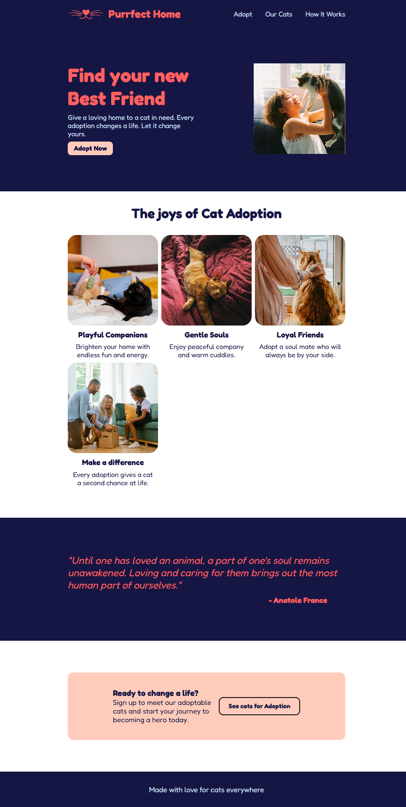

# Odin Landing Page - Cat Adoption 🐾

A **static landing page** for cat adoption, created as the final project of the CSS Foundations module from [The Odin Project](https://www.theodinproject.com/).

🔗 **Live Demo:** [View here](https://karenartc.github.io/odin-landingPage/)

---

## 📸 Preview

---

## 📝 Notes

This page was built based on the **layout provided by The Odin Project** for educational purposes.  
I applied **custom colors, fonts, and theme adjustments**, but the original layout design is not mine.

---

## 🐱 Image & Logo Credits

All images are from **free resources (Pexels)**:

- **Hero photo**: [Ánh Đặng](https://www.pexels.com/photo/smiling-girl-playing-with-cat-16392187/)  
- **Playful companion**: [cottonbro studio](https://www.pexels.com/photo/black-cat-on-the-bed-6864016/)  
- **Gentle soul**: [Dương Nhân](https://www.pexels.com/photo/orange-tabby-cat-on-bed-2817412/)  
- **Loyal friend**: [Dmitriy Ganin](https://www.pexels.com/photo/crop-anonymous-lady-sitting-on-floor-and-stroking-curious-cat-near-window-7716390/)  
- **Make a difference**: [MART PRODUCTION](https://www.pexels.com/photo/parents-giving-their-daughter-a-kitten-8434656/)  
- **Logo**: Canva template by [Virinadesign](https://www.canva.com/p/virinadesign/)

---

## 📄 License

This project is for **educational purposes only**.  
All image rights belong to their respective authors.
